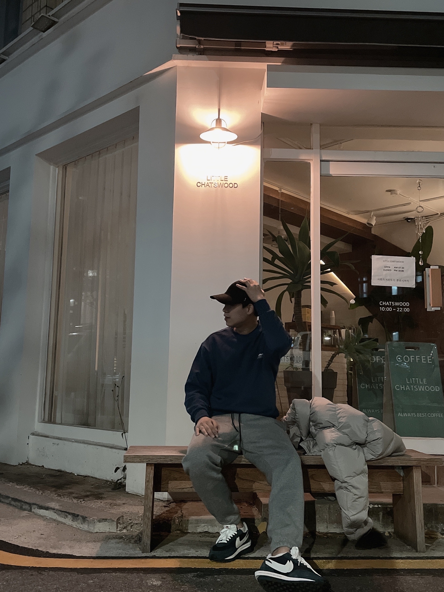
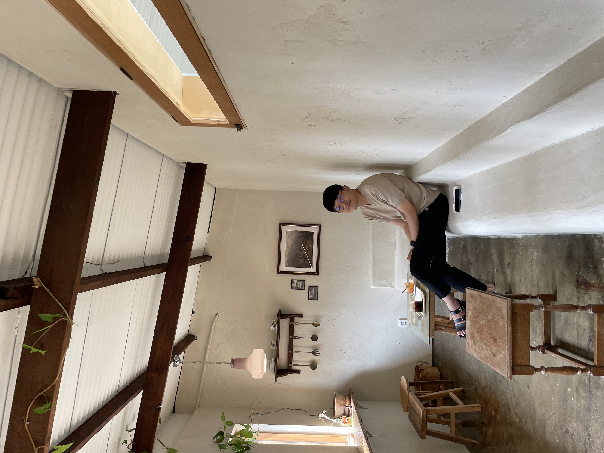
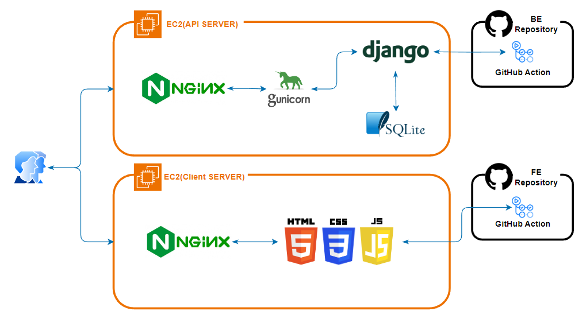

# 놀러 Wassup - 숙박 지원 서비스
## 🙌 안녕하세요.
|강경모|이창현|황병헌|
|:---:|:---:|:---:|
||||
|<a href="https://github.com/ggengmo">🔗 Kang Gyeong Mo</a>|<a href="https://github.com/abcdqwer1">🔗 Lee Chang Hyeon</a>|<a href="https://github.com/Ruler-H">🔗 Hwang Byeong Heon</a>|

## 목차
[1. 목표와 기능](#1-목표와-기능)  
[2. 개발 기술 및 환경, 개발 일정](#2-개발-기술-및-환경-개발-일정)  
[3. 배포 URL 및 아키텍쳐](#3-배포-url-및-아키텍쳐)  
[4. 요구사항 및 기능 명세](#4-요구사항-및-기능-명세)  
[5. 화면 설계(Wireframe)](#5-화면-설계wireframe)  
[6. 데이터베이스 모델링(ER Diagram)](#6-데이터베이스-모델링er-diagram)  
[7. API 명세서](#7-api-명세서)  
[8. 프로젝트 구조](#8-프로젝트-구조)  
[9. UI](#9-ui)  
[10. 메인 기능](#10-메인-기능)  
[11. 부가 기능](#11-부가-기능)  
[12. 개발 이슈](#12-개발-이슈)  
[13. 개발 회고](#13-개발-회고)

## 1. 목표와 기능
### 1-1. 목표
- 국내 여행을 목적으로 하는 사용자들에게 여행 간 필요한 총괄 서비스를 제공하는 플랫폼
- 숙소, 차량, 교통 예약 플랫폼
- 여행객들 간의 커뮤니티 제공 플랫폼

### 1-2. 기능
- 지역 여행지 별 숙소 목록 제공 기능
- 원하는 지역의 숙소, 렌트카 예약 기능
- 여행지 리뷰를 통한 여행객 정보 공유 기능

#### [Flow Chart]


<div align="right">

[목차](#목차)

</div>

## 2. 개발 기술 및 환경, 개발 일정 
### 2-1. 개발 기술
#### [기술 - FE]  
<div>
    
    
    
    
</div>

#### [기술 - BE]
<div>
    
    
</div>

#### [기술 - DB]
<div>
    
</div>

### 2-2. 개발 환경
<div>
    
    
    
    
    
    
</div>

### 2-3. 개발 일정
작성 필요

<div align="right">

[목차](#목차)

</div>

## 3. 배포 URL 및 아키텍쳐
### 3-1. 배포 URL
#### [Django(API) 서버]  
https://api.nolreowassup.shop/

#### [클라이언트(Frontend) 서버]  
https://www.nolreowassup.shop/
```
배포 테스트 계정
ID : test@test.com
PW : test123!@#
```

### 3-2. 배포 아키텍쳐


## 4. 요구사항 및 기능 명세


## 5. 화면 설계(Wireframe)
<a href="https://ovenapp.io/project/A2aAFGcE1yeBkiGoZkLPzmfXP2IdoMQF#yRAOo">화면설계 테스트 페이지 바로가기</a> <br/>

<br/>

|||
|-|-|
|로그인 화면|회원 가입 화면|
|프로필 화면|프로필 수정 화면|
|숙소 상세1 화면|숙소 상세2 화면|
|숙소 상세3 화면|숙소 목록1 화면|
|숙소 목록2 화면|숙소 예약 화면|
|렌트카 상세1 화면|렌트카 상세2 화면|
|렌트카 상세3 화면|렌트카 목록1 화면|
|렌트카 목록2 화면|렌트카 예약 화면|
|교통 상세1 화면|교통 상세2 화면|
|교통 목록1 화면|교통 목록2 화면|
|예약 상세 화면|예약 수정 화면|
|예약 목록 화면|찜 목록1 화면|
|찜 목록2 화면||

## 6. 데이터베이스 모델링(ER Diagram)
  

## 7. API 명세서
|app: account|HTTP Method|설명|로그인 권한 필요|작성자 권한 필요|Admin 권한|
|:-|:-|:-|:-:|:-:|:-:|
|'signup/'|POST|회원가입|||
|'login/'|POST|로그인(토큰 발급)|||
|'refresh/'|POST|만료 토큰 재발급|||
|'\<int:pk\>/'|GET|프로필 조회|✅|✅||
|'\<int:pk\>/'|PATCH|프로필 수정|✅|✅||
|'\<int:pk\>/'|DELETE|회원 탈퇴|✅|✅||
|'password/'|PATCH|회원 비밀번호 변경|✅|✅||
<br>  

|app: lodging|HTTP Method|설명|로그인 권한|작성자 권한|Admin 권한|
|:-|:-|:-|:-:|:-:|:-:|
|''|POST|숙소 생성 |||✅|
|'\<int:lodging_pk\>/'|GET|숙소 상세||||
|''|GET|숙소 목록||||
|'\<int:lodging_pk\>/'|PATCH|숙소 정보 수정|||✅|
|'\<int:lodging_pk\>/'|DELETE|숙소 삭제|||✅|
|'images/'|POST|숙소 이미지 생성|||✅|
|'images/'|GET|숙소 이미지 목록||||
|'images/\<int:image_pk\>/'|GET|숙소 이미지 상세||||
|'images/\<int:image_pk\>/'|PATCH|숙소 이미지 수정|||✅|
|'images/\<int:image_pk\>/'|DELETE|숙소 이미지 삭제|||✅|
|'amenity/'|POST|숙소 편의시설 생성|||✅|
|'amenity/\<int:amentiy_pk\>/'|GET|숙소 편의시설 상세||||
|'amenity/\<int:amentiy_pk\>/'|PATCH|숙소 편의시설 수정|||✅|
|'amenity/\<int:amentiy_pk\>/'|DELETE|숙소 편의시설 삭제|||✅|
|'roomtype/'|POST|객실 생성|||✅|
|'roomtype/\<int:roomtype_pk\>/'|GET|객실 상세||||
|'roomtype/\<int:roomtype_pk\>/'|PATCH|객실 수정|||✅|
|'roomtype/\<int:roomtype_pk\>/'|DELETE|객실 삭제|||✅|
|'roomtype/image/'|POST|객실 이미지 생성|||✅|
|'roomtype/image/\<int:roomtype_pk\>/'|GET|객실 이미지 상세||||
|'roomtype/image/\<int:roomtype_pk\>/'|PATCH|객실 이미지 수정|||✅|
|'roomtype/image/\<int:roomtype_pk\>/'|DELETE|객실 이미지 삭제|||✅|
|'review/'|POST|리뷰 생성|✅|||
|'review/'|GET|리뷰 목록||||
|'review/\<int:review_pk\>/'|PATCH|리뷰 수정|✅|✅||
|'review/\<int:review_pk\>/'|DELETE|리뷰 삭제|✅|✅||
|'review/image/'|POST|리뷰 이미지 생성|✅|||
|'review/image/'|GET|리뷰 이미지 목록||||
|'review/image/\<int:review_pk\>/'|PATCH|리뷰 이미지 수정|✅|✅||
|'review/image/\<int:review_pk\>/'|DELETE|리뷰 이미지 삭제|✅|✅||
|'review/\<int:review_pk\>/comment/'|POST|리뷰 답글 생성|✅|||
|'review/\<int:review_pk\>/comment/'|GET|리뷰 답글 목록||||
|'review/\<int:review_pk\>/comment/\<int:comment_pk\>/'|PATCH|리뷰 답글 수정|✅|✅||
|'review/\<int:review_pk\>/comment/\<int:comment_pk\>/'|DELETE|리뷰 답글 삭제|✅|✅||
<br>

|app: traffic|HTTP Method|설명|로그인 권한|작성자 권한|Admin 권한|
|:-|:-|:-|:-:|:-:|:-:|
|'bus/'|POST|버스 생성 |||✅|
|'bus/\<int:bus_pk\>/'|GET|버스 상세||||
|'bus/'|GET|버스 목록||||
|'bus/\<int:bus_pk\>/'|PUT|버스 정보 수정|||✅|
|'bus/\<int:bus_pk\>/'|DELETE|버스 삭제|||✅|
|'train/'|POST|교통 생성 |||✅|
|'train/\<int:train_pk\>/'|GET|기차 상세||||
|'train/'|GET|기차 목록||||
|'train/\<int:train_pk\>/'|PUT|기차 정보 수정|||✅|
|'train/\<int:train_pk\>/'|DELETE|기차 삭제|||✅|
|'rentalcar/'|POST|렌트카 생성 |||✅|
|'rentalcar/\<int:rentalcar_pk\>/'|GET|렌트카 상세||||
|'rentalcar/'|GET|렌트카 목록||||
|'rentalcar/\<int:rentalcar_pk\>/'|PUT|렌트카 정보 수정|||✅|
|'rentalcar/\<int:rentalcar_pk\>/'|DELETE|렌트카 삭제|||✅|
|'review/'|POST|리뷰 생성|✅|||
|'review/'|GET|리뷰 목록||||
|'review/\<int:review_pk\>/'|PUT|리뷰 수정|✅|✅||
|'review/\<int:review_pk\>/'|DELETE|리뷰 삭제|✅|✅||
|'reply/'|POST|답글 생성||✅|✅|
|'reply/'|GET|답글 목록||||
|'reply/\<int:reply_pk\>/'|PUT|답글 수정||✅|✅|
|'reply/\<int:reply_pk\>/'|DELETE|답글 삭제||✅|✅|
<br>

|app: pick|HTTP Method|설명|로그인 권한|작성자 권한|Admin 권한|
|:-|:-|:-|:-:|:-:|:-:|
|'lodging/'|POST|숙소 찜 생성|✅|||
|'lodging/'|GET|숙소 찜 목록|✅|✅||
|'lodging/\<int:pick_pk\>/'|DELETE|숙소 찜 삭제|✅|✅||
|'bus/'|POST|버스 찜 생성|✅|||
|'bus/'|GET|버스 찜 목록|✅|✅||
|'bus/\<int:pick_pk\>/'|DELETE|버스 찜 삭제|✅|✅||
|'train/'|POST|기차 찜 생성|✅|||
|'train/'|GET|기차 찜 목록|✅|✅||
|'train/\<int:pick_pk\>/'|DELETE|기차 찜 삭제|✅|✅||
|'rental_car/'|POST|렌트카 찜 생성|✅|||
|'rental_car/'|GET|렌트카 찜 목록|✅|✅||
|'rental_car/\<int:pick_pk\>/'|DELETE|렌트카 찜 삭제|✅|✅||
|''|GET|전체 찜 목록|✅|✅||
<br>

|app: reservation|HTTP Method|설명|로그인 권한|작성자 권한|Admin 권한|
|:-|:-|:-|:-:|:-:|:-:|
|'lodging/'|POST|숙소 예약 생성|✅|||
|'lodging/'|GET|숙소 예약 목록|✅|✅||
|'lodging/\<int:reservation_pk\>/'|PATCH|숙소 예약 수정|✅|✅||
|'lodging/\<int:reservation_pk\>/'|DELETE|숙소 예약 삭제|✅|✅||
|'bus/'|POST|버스 예약 생성|✅|||
|'bus/'|GET|버스 예약 목록|✅|✅||
|'bus/\<int:reservation_pk\>/'|DELETE|버스 예약 삭제|✅|✅||
|'train/'|POST|기차 예약 생성|✅|||
|'train/'|GET|기차 예약 목록|✅|✅||
|'train/\<int:reservation_pk\>/'|DELETE|기차 예약 삭제|✅|✅||
|'rental_car/'|POST|렌트카 예약 생성|✅|||
|'rental_car/'|GET|렌트카 예약 목록|✅|✅||
|'rental_car/\<int:reservation_pk\>/'|PATCH|렌트카 예약 수정|✅|✅||
|'rental_car/\<int:reservation_pk\>/'|DELETE|렌트카 예약 삭제|✅|✅||

## 8. 프로젝트 구조
### 8-1. BE 프로젝트 구조
```
📦nolreo_wassup_BE
 ┣ 📂.git
 ┣ 📂account
 ┃ ┣ 📜managers.py
 ┃ ┣ 📜models.py
 ┃ ┣ 📜serializers.py
 ┃ ┣ 📜tests.py
 ┃ ┣ 📜urls.py
 ┃ ┣ 📜views.py
 ┣ 📂lodging
 ┃ ┣ 📂tests
 ┃ ┣ 📜models.py
 ┃ ┣ 📜serializers.py
 ┃ ┣ 📜urls.py
 ┃ ┣ 📜views.py
 ┣ 📂nolreo_wassup
 ┃ ┣ 📜settings.py
 ┃ ┣ 📜urls.py
 ┣ 📂pick
 ┃ ┣ 📜models.py
 ┃ ┣ 📜serializers.py
 ┃ ┣ 📜tests.py
 ┃ ┣ 📜urls.py
 ┃ ┣ 📜views.py
 ┣ 📂reservation
 ┃ ┣ 📜models.py
 ┃ ┣ 📜serializers.py
 ┃ ┣ 📜tests.py
 ┃ ┣ 📜urls.py
 ┃ ┣ 📜views.py
 ┣ 📂static
 ┃ ┗ 📂assets
 ┃ ┃ ┗ 📂images
 ┣ 📂traffic
 ┃ ┣ 📂tests
 ┃ ┣ 📜models.py
 ┃ ┣ 📜serializers.py
 ┃ ┣ 📜urls.py
 ┃ ┣ 📜views.py
 ┣ 📂utils
 ┃ ┣ 📜permissions.py
 ┃ ┗ 📜tools.py
 ┣ 📜.env
 ┣ 📜.gitignore
 ┣ 📜CONVENTION.md
 ┣ 📜db.sqlite3
 ┣ 📜manage.py
 ┣ 📜README.md
 ┗ 📜requirements.txt
```
### 8-2. FE 프로젝트 구조
추가 필요
## 9. UI
## 10. 메인 기능
## 11. 부가 기능
## 12. 개발 이슈
### 12-1. Github Action 설정 중 SECRET KEY 설정 오류
#### 12-1-1. 문제 원인
```shell
django.core.exceptions.ImproperlyConfigured: The SECRET_KEY setting must not be empty.
github action
```
- Github Action을 설정하던 중 위와 같은 오류가 발생하게 되었는데, 오류를 해석해 보니 django를 실행할 때 사용되는 SECRET_KEY가 없어서 생기는 오류였다.
- 하지만 Github setting에서 시크릿 키로 설정해주었는데도 해당 오류가 발생하는게 의문이었습니다. 추가적으로 Github Action을 설정한 코드를 확인하며 찾은 원인은 테스트 코드에 있었습니다.
- 테스트 코드를 실행하기 위해서는 Github Action을 통해 설정한 가상환경에도 SECRET_KEY가 따로 세팅이 되어야 테스트 코드를 위한 Django 실행에 오류가 생기지 않을 수 있었기 때문에 오류가 발생하였던 것입니다
#### 12-1.2. 해결 방법
```yml
# 수정 전 코드
- name: Run Tests
    run: |
        python manage.py test
# 수정 후 코드
- name: Run Tests
    run: |
        python manage.py test
    env :
        SECRET_KEY: ${{ secrets.SECRET_KEY }}
        DEBUG: ${{ secrets.DEBUG }}
```
- 원인 확인 위와 같이 작성했던 코드에 환경 변수를 적용하는 코드를 추가해주어 테스트 코드 실행 시 SECRET_KEY를 적용하여 해결할 수 있었습니다.

### 12-2. Github Action 설정 중 인증 실패 오류
#### 12-2-1. 문제 원인
```shell
ssh: handshake failed: ssh: unable to authenticate, attempted methods [none password], no supported methods remain
```
- 기존에 Github Action 설정 시 사용했던 username과 password를 기반으로 하는 설정을 하는 경우 위와 같은 오류가 발생하는 상황이었습니다.
- 해당 오류는 인증 과정 중 서버가 해당 인증 방법을 지원하지 않아 발생하는 오류였습니다.
#### 12-2-2. 해결 방법
- 오류 해결을 위해서 key를 사용하는 인증 방법을 적용하였습니다.
- key를 사용하는 인증을 위해서는 현재 프로젝트에서 사용하는 EC2 서버에서 받은 pem 파일 내의 key 값을 Github setting에서 키 값을 'PEM_SECRET'으로 하는 시크릿 키로 설정해주었습니다.
```yml
# 수정 전 코드
- name: 서버 배포
    uses: appleboy/ssh-action@master
    with:
        host: ${{ secrets.SERVER_HOST }}
        username: ${{ secrets.SERVER_USER }}
        password: ${{ secrets.SERVER_PASSWORD }}
        script: |
# 수정 후 코드
- name: 서버 배포
    uses: appleboy/ssh-action@master
    with:
        host: ${{ secrets.SERVER_HOST }}
        username: ${{ secrets.SERVER_USER }}
        key: ${{ secrets.PEM_SECRET }}
        script: |
```
- 이후 위와 같이 기존의 password로 서버에 접근하는 방식에서 key로 접근하는 방식으로 Github Action 코드를 변경하여 문제를 해결할 수 있었습니다.

### 12-3. 숙소 API CRUD 테스트 케이스 작성 중 에러
#### 12-3-1. 문제 원인
- lodging 앱 테스트 중 `/lodging/images` 경로로 POST 요청시 400 error가 발생하였습니다.
- 에러의 원인은 lodging 앱의 urls.py에서 설정한 router의 문제였습니다. 아래와 같이 라우터 하나에 두개의 ViewSet을 등록하는 경우 처음 설정한 ViewSet이 /lodging으로 시작하는 모든 URL 요청을 받아 처리하기 때문에 `/lodging/imges` 요청이 두 번째 ViewSet에서 처리되지 않았던 것이었습니다.
```python
router = DefaultRouter()
router.register('', views.LodgingViewSet)
router.register('images', views.LodgingImageViewSet)
```

#### 12-3-2. 해결 방법
- 해당 에러는 `router.register('', views.LodgingViewSet)`보다 `router.register('images', views.LodgingImageViewSet)`이 URL 요청을 먼저 받게 해주는 방법이 필요했기 때문에 아래 코드와 같이 라우터에 ViewSet을 설정하는 위치를 변경해주어 정상동작을 확인할 수 있었습니다.
```python
router = DefaultRouter()
router.register('images', views.LodgingImageViewSet)
router.register('', views.LodgingViewSet)
```

### 12-4. Admin 권한으로만 요청 가능한 수정 관련 API에 patch 메소드가 허용되는 문제
#### 12-4-1. 문제 원인
- 숙소 관련 테스트 중 일반사용자와 로그인하지 않은 사용자가 수정이 불가능한지 확인하는 테스트를 진행하는 중 put 메소드를 사용했을때는 HTTP 코드 401 뜨는것을 확인했지만, 똑같인 401 응답이 와야하는 patch 메소드로 바꾸면 HTTP 코드가 200이 나오는 문제가 있었습니다.
- 이 문제는 숙소 ViewSet의 get_permissions에서 아래와 같이 권한을 준 것이 원인이었습니다.
```python
def get_permissions(self):
    if self.action in ['create', 'update', 'destroy']:
        permission_classes = [IsAdminUser]
    else:
        permission_classes = [AllowAny]
    return [permission() for permission in permission_classes]
```
- Admin 권한으로 제한하는 IsAdminUser가 적용되는 update는 put 요청을 받고, patch 요청은 partial_update에서 처리하기 때문에 patch 요청에 대해서 정상 응답을 한 것이었습니다.

#### 12-4-2. 해결 방법
- IsAdminUser 권한을 주는 코드 중 아래와 같이 patial_update를 대상에 추가시켜 정상 동작할 수 있도록 하였습니다.
```python
def get_permissions(self):
    if self.action in ['create', 'update', 'patial_update', 'destroy']:
        permission_classes = [IsAdminUser]
    else:
        permission_classes = [AllowAny]
    return [permission() for permission in permission_classes]
```
- ModelViewSet에서 patch는 patial_update에서 처리되기 때문에, patch에 대한 권한 제한을 적용할 때는 위의 코드와 같이 적용해주어야할 것입니다.


## 13. 개발 회고
```text
👩🏻‍💻 강경모
작성 필요

👩🏻‍💻 이창현
작성 필요

👩🏻‍💻 황병헌
작성 필요
 TDD로 시작한 개발은 협업에 도움이 됐다
```