# 놀러 Wassup - 숙박 지원 서비스
## 목차
[1. 목표와 기능](#1-목표와-기능)  
[2. 개발 기술 및 환경, 개발 일정](#2-개발-기술-및-환경-개발-일정)  
[3. 배포 URL 및 아키텍쳐](#3-배포-url-및-아키텍쳐)  
[4. 요구사항 및 기능 명세](#4-요구사항-및-기능-명세)  
[5. 화면 설계(Wireframe)](#5-화면-설계wireframe)  
[6. 데이터베이스 모델링(ER Diagram)](#6-데이터베이스-모델링er-diagram)  
[7. API 명세서](#7-api-명세서)  
[8. 프로젝트 구조](#8-프로젝트-구조)  
[9. UI](#9-ui)  
[10. 메인 기능](#10-메인-기능)  
[11. 부가 기능](#11-부가-기능)  
[12. 개발 이슈](#12-개발-이슈)  
[13. 개발 회고](#13-개발-회고)

## 1. 목표와 기능
### 1-1. 목표
- 국내 여행을 목적으로 하는 사용자들에게 여행 간 필요한 총괄 서비스를 제공하는 플랫폼
- 숙소, 차량, 음식점, 교통 예약 플랫폼
- 여행객들 간의 커뮤니티 제공 플랫폼

### 1-2. 기능
- 지역 여행지 별 숙소 목록 제공 기능
- 원하는 지역의 숙소, 렌트카, 음식점 예약 기능
- 여행지 리뷰를 통한 여행객 정보 공유 기능

#### [Flow Chart]


<div align="right">

[목차](#목차)

</div>

## 2. 개발 기술 및 환경, 개발 일정 
### 2-1. 개발 기술
#### [기술 - FE]  
<div>
    
    
    
    
</div>

#### [기술 - BE]
<div>
    
    
</div>

#### [기술 - DB]
<div>
    
</div>

### 2-2. 개발 환경
<div>
    배포 기술 추가 필요<br/>
    
    
    
    <br/>if 협업 툴 추가되면 추가 필요
</div>

### 2-3. 개발 일정
작성 필요

<div align="right">

[목차](#목차)

</div>

## 3. 배포 URL 및 아키텍쳐
### 3-1. 배포 URL
#### [Django(API) 서버]  
작성 필요

#### [클라이언트(FrontEnd) 서버]  
작성 필요
```
배포 테스트 계정
작성 필요
```

### 3-2. 배포 아키텍쳐
작성 필요

## 4. 요구사항 및 기능 명세
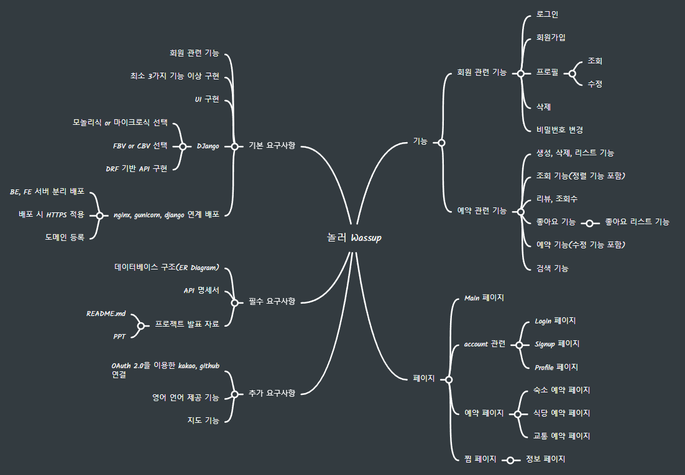

## 5. 화면 설계(Wireframe)
<a href="https://ovenapp.io/project/A2aAFGcE1yeBkiGoZkLPzmfXP2IdoMQF#yRAOo">화면설계 테스트 페이지 바로가기</a> <br/>

<br/>

|||
|-|-|
|로그인 화면|회원 가입 화면|
|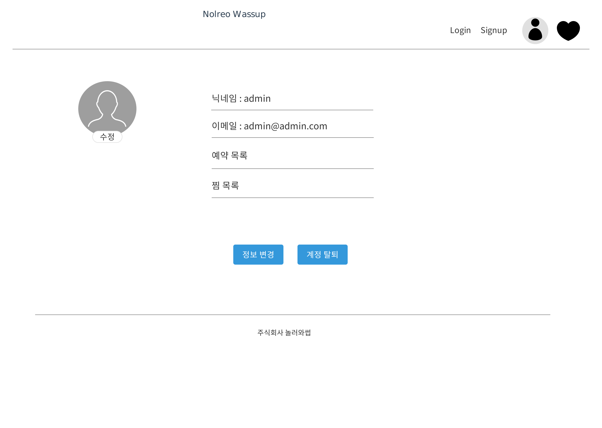프로필 화면|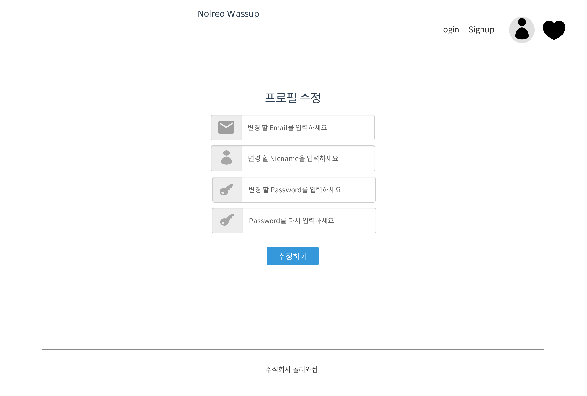프로필 수정 화면|
|숙소 상세1 화면|숙소 상세2 화면|
|숙소 상세3 화면|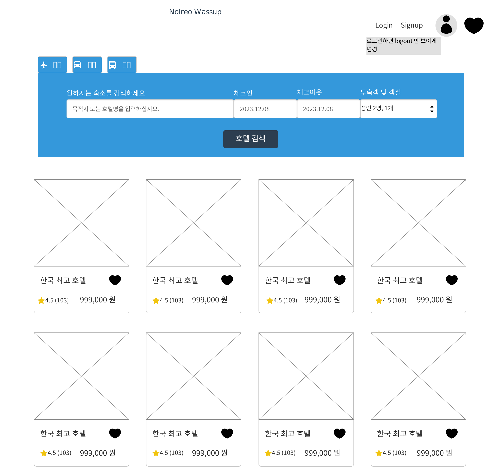숙소 목록1 화면|
|숙소 목록2 화면|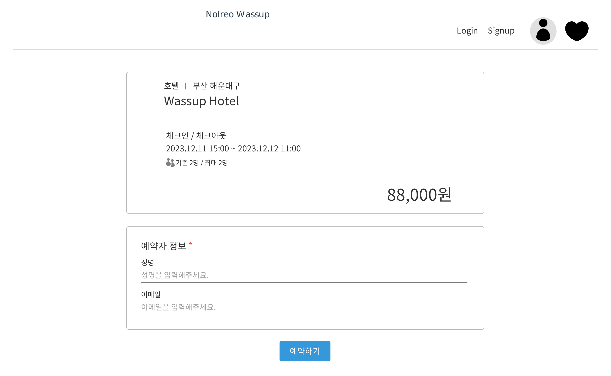숙소 예약 화면|
|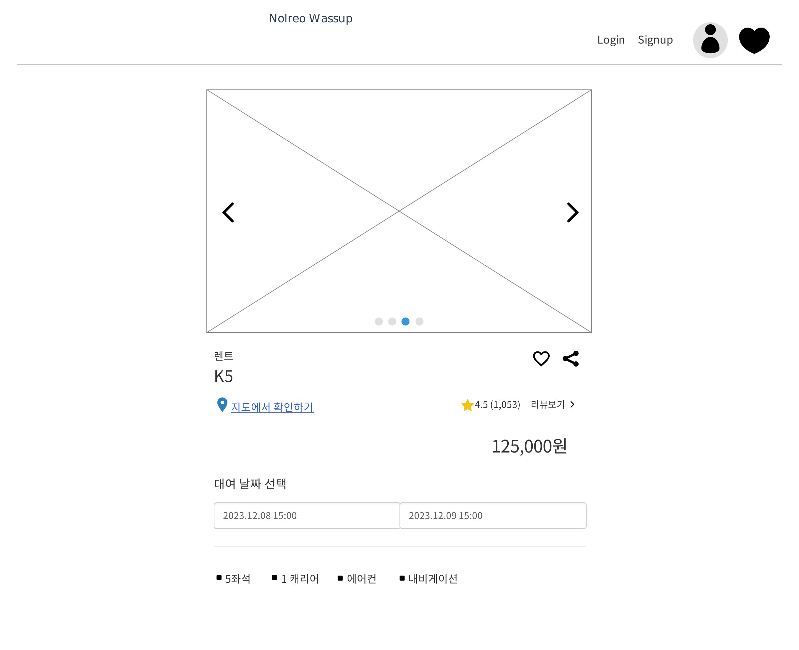렌트카 상세1 화면|렌트카 상세2 화면|
|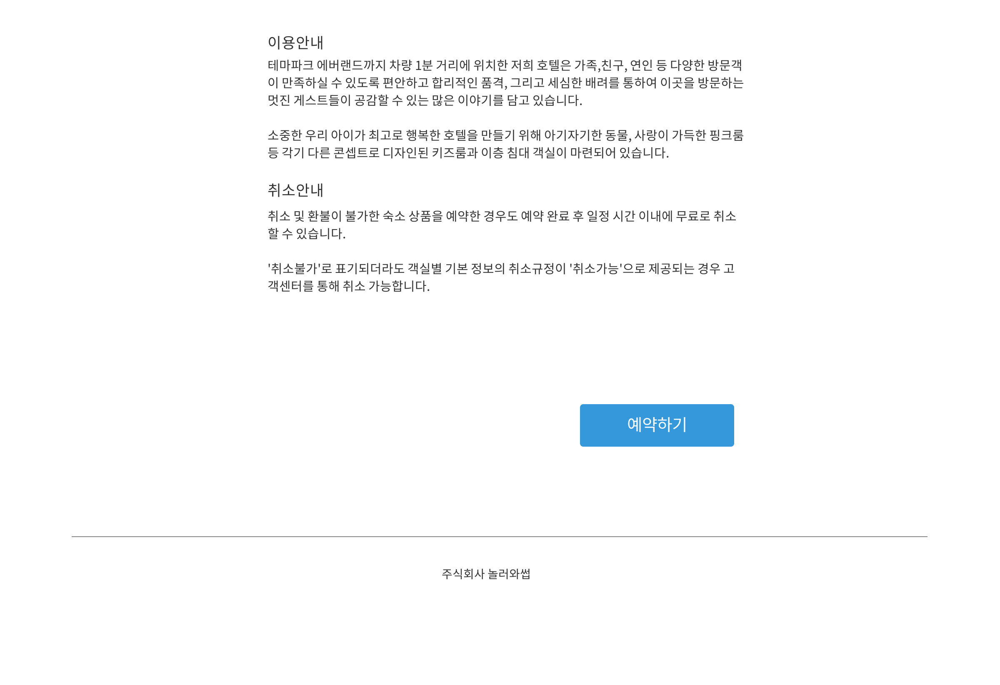렌트카 상세3 화면|렌트카 목록1 화면|
|렌트카 목록2 화면|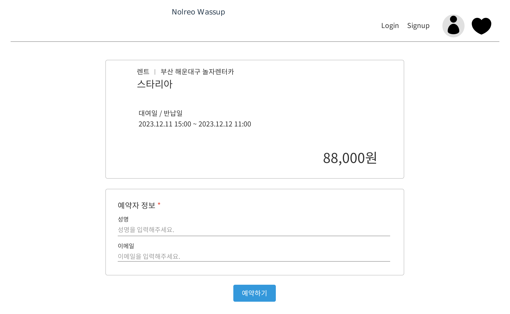렌트카 예약 화면|
|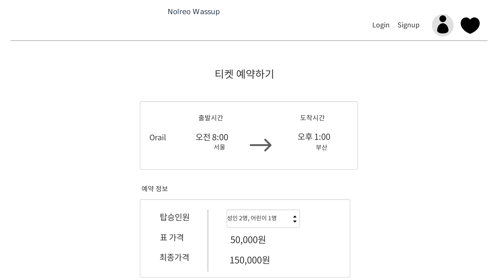교통 상세1 화면|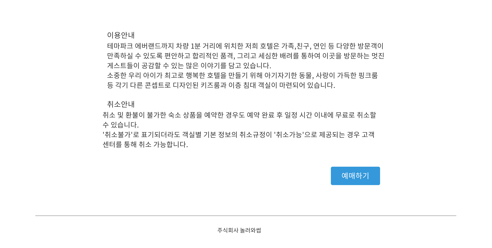교통 상세2 화면|
|교통 목록1 화면|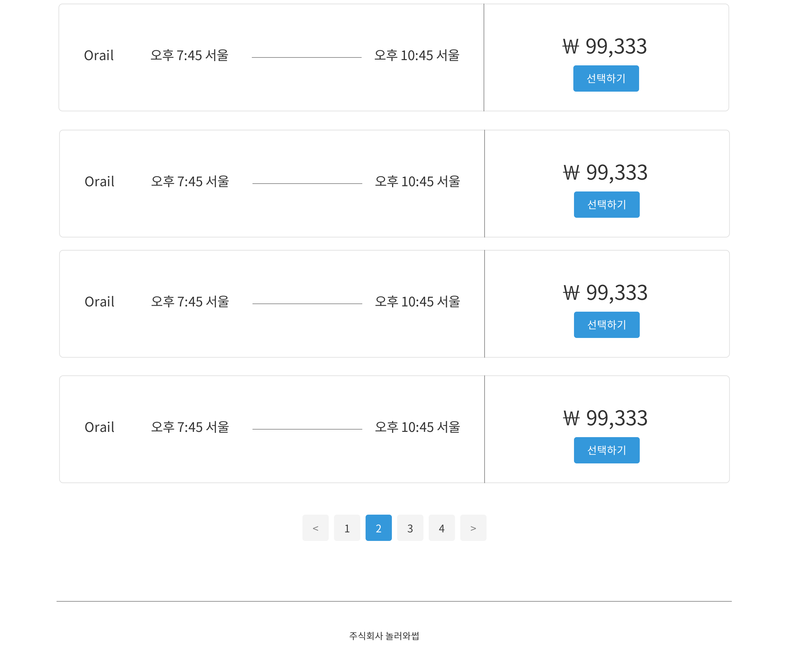교통 목록2 화면|
|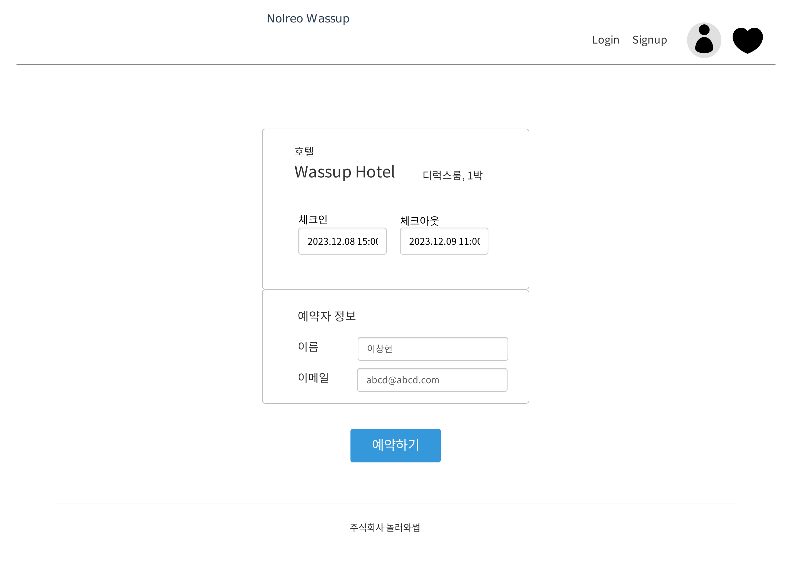예약 상세 화면|예약 수정 화면|
|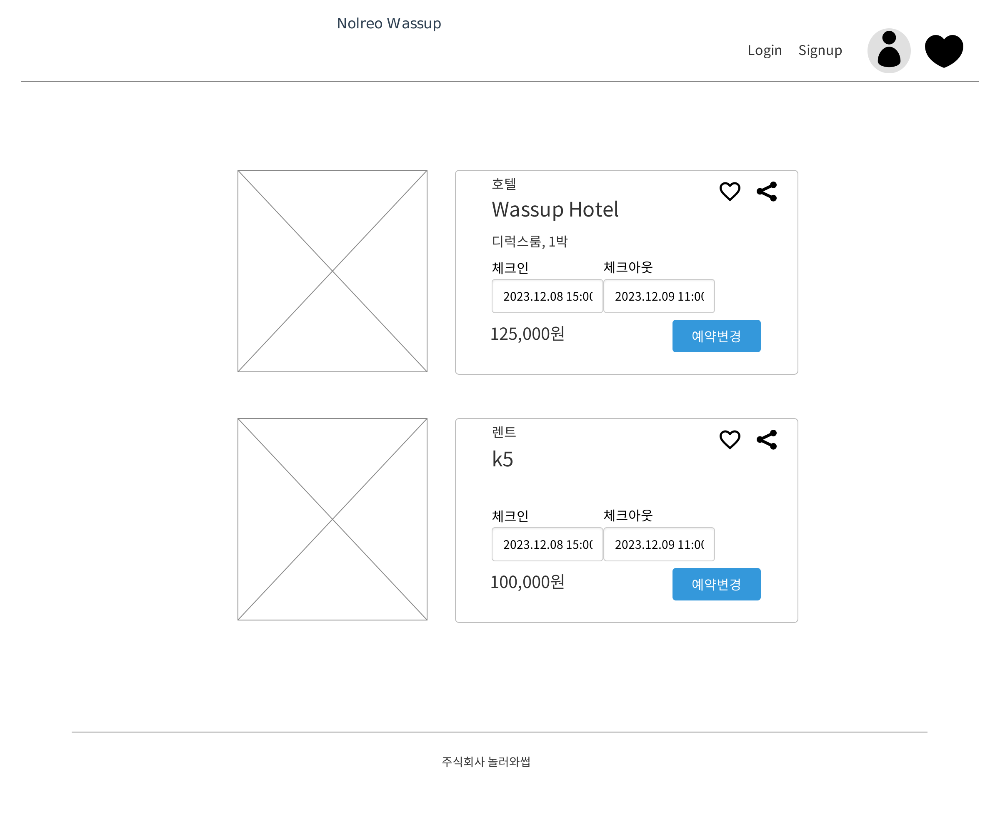예약 목록 화면|찜 목록1 화면|
|찜 목록2 화면||

## 6. 데이터베이스 모델링(ER Diagram)
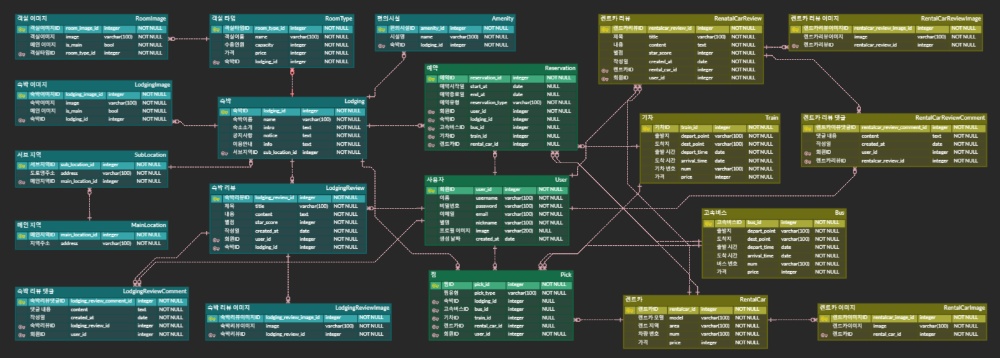  

## 7. API 명세서
|app: account|HTTP Method|설명|로그인 권한 필요|작성자 권한 필요|Admin 권한|
|:-|:-|:-|:-:|:-:|:-:|
|'signup/'|POST|회원가입|||
|'login/'|POST|로그인(토큰 발급)|||
|'refresh/'|POST|만료 토큰 재발급|||
|'\<int:pk\>/'|GET|프로필 조회|✅|✅||
|'\<int:pk\>/'|PATCH|프로필 수정|✅|✅||
|'\<int:pk\>/'|DELETE|회원 탈퇴|✅|✅||
|'password/'|PATCH|회원 비밀번호 변경|✅|✅||
<br>  

|app: lodging|HTTP Method|설명|로그인 권한|작성자 권한|Admin 권한|
|:-|:-|:-|:-:|:-:|:-:|
|''|POST|숙소 생성 |||✅|
|'\<int:lodging_pk\>/'|GET|숙소 상세||||
|''|GET|숙소 목록||||
|'\<int:lodging_pk\>/'|PUT|숙소 정보 수정|||✅|
|'\<int:lodging_pk\>/'|DELETE|숙소 삭제|||✅|
|'review/'|POST|리뷰 생성|✅|||
|'review/'|GET|리뷰 목록||||
|'review/\<int:review_pk\>/'|PUT|리뷰 수정|✅|✅||
|'review/\<int:review_pk\>/'|DELETE|리뷰 삭제|✅|✅||
|'reply/'|POST|답글 생성|✅|✅||
|'reply/'|GET|답글 목록||||
|'reply/\<int:reply_pk\>/'|PUT|리뷰 답글 수정|✅|✅||
|'reply/\<int:reply_pk\>/'|DELETE|리뷰 답글 삭제|✅|✅||
<br>

|app: traffic|HTTP Method|설명|로그인 권한|작성자 권한|Admin 권한|
|:-|:-|:-|:-:|:-:|:-:|
|'bus/'|POST|버스 생성 |||✅|
|'bus/\<int:bus_pk\>/'|GET|버스 상세||||
|'bus/'|GET|버스 목록||||
|'bus/\<int:bus_pk\>/'|PUT|버스 정보 수정|||✅|
|'bus/\<int:bus_pk\>/'|DELETE|버스 삭제|||✅|
|'train/'|POST|교통 생성 |||✅|
|'train/\<int:train_pk\>/'|GET|기차 상세||||
|'train/'|GET|기차 목록||||
|'train/\<int:train_pk\>/'|PUT|기차 정보 수정|||✅|
|'train/\<int:train_pk\>/'|DELETE|기차 삭제|||✅|
|'rentalcar/'|POST|렌트카 생성 |||✅|
|'rentalcar/\<int:rentalcar_pk\>/'|GET|렌트카 상세||||
|'rentalcar/'|GET|렌트카 목록||||
|'rentalcar/\<int:rentalcar_pk\>/'|PUT|렌트카 정보 수정|||✅|
|'rentalcar/\<int:rentalcar_pk\>/'|DELETE|렌트카 삭제|||✅|
|'review/'|POST|리뷰 생성|✅|||
|'review/'|GET|리뷰 목록||||
|'review/\<int:review_pk\>/'|PUT|리뷰 수정|✅|✅||
|'review/\<int:review_pk\>/'|DELETE|리뷰 삭제|✅|✅||
|'reply/'|POST|답글 생성||✅|✅|
|'reply/'|GET|답글 목록||||
|'reply/\<int:reply_pk\>/'|PUT|답글 수정||✅|✅|
|'reply/\<int:reply_pk\>/'|DELETE|답글 삭제||✅|✅|
<br>

|app: pick|HTTP Method|설명|로그인 권한|작성자 권한|Admin 권한|
|:-|:-|:-|:-:|:-:|:-:|
|'lodging/'|POST|숙소 찜 생성|✅|||
|'lodging/'|GET|숙소 찜 목록|✅|✅||
|'lodging/\<int:pick_pk\>/'|DELETE|숙소 찜 삭제|✅|✅||
|'bus/'|POST|버스 찜 생성|✅|||
|'bus/'|GET|버스 찜 목록|✅|✅||
|'bus/\<int:pick_pk\>/'|DELETE|버스 찜 삭제|✅|✅||
|'train/'|POST|기차 찜 생성|✅|||
|'train/'|GET|기차 찜 목록|✅|✅||
|'train/\<int:pick_pk\>/'|DELETE|기차 찜 삭제|✅|✅||
|'rental_car/'|POST|렌트카 찜 생성|✅|||
|'rental_car/'|GET|렌트카 찜 목록|✅|✅||
|'rental_car/\<int:pick_pk\>/'|DELETE|렌트카 찜 삭제|✅|✅||
<br>

|app: reservation|HTTP Method|설명|로그인 권한|작성자 권한|Admin 권한|
|:-|:-|:-|:-:|:-:|:-:|
|'lodging/'|POST|숙소 예약 생성|✅|||
|'lodging/'|GET|숙소 예약 목록|✅|✅||
|'lodging/\<int:reservation_pk\>/'|PUT|숙소 예약 수정|✅|✅||
|'lodging/\<int:reservation_pk\>/'|DELETE|숙소 예약 삭제|✅|✅||
|'traffic/'|POST|교통 예약 생성|✅|||
|'traffic/'|GET|교통 예약 목록|✅|✅||
|'traffic/\<int:reservation_pk\>/'|PUT|교통 예약 수정|✅|✅||
|'traffic/\<int:reservation_pk\>/'|DELETE|교통 예약 삭제|✅|✅||