# 놀러 Wassup - 숙박 지원 서비스
## 🙌 안녕하세요.
|강경모|이창현|황병헌|
|:---:|:---:|:---:|
||||
|<a href="https://github.com/ggengmo">🔗 Kang Gyeong Mo</a>|<a href="https://github.com/abcdqwer1">🔗 Lee Chang Hyeon</a>|<a href="https://github.com/Ruler-H">🔗 Hwang Byeong Heon</a>|
|‣ 요구사항 및 기능 명세<br>‣ API 설계 (API 명세서)<br>‣ 교통 API 개발<br>‣ UI 개발(메인 페이지[숙소, 교통, 렌터카])<br>‣ JavaScript 개발(숙소 상세, 댓글 & 대댓글 API 연동)|‣ 요구사항 및 기능 명세<br>‣ UI(화면) 설계 (Wireframe)<br>‣ 숙소 API 개발<br>‣ UI 개발(숙소&렌터카 상세 페이지, 계정 관련 페이지[로그인, 프로필, 회원가입], 예약&찜 페이지)<br>‣ JavaScript 개발(숙소, 렌트, 교통 조회 및 목록, 검색 & 찜 생성 API 연동)|‣ 요구사항 및 기능 명세<br>‣ 데이터베이스 모델링 (ER Diagram)<br>‣ Flow Chart 설계<br>‣ 배포 구조 설계 (배포 Architecture)<br>‣ 계정, 찜, 예약 API 개발<br>‣ API, Client 서버 배포(nginx, gunicorn, EC2, GitHub Actions)<br>‣ JavaScript 개발(계정, 찜, 예약 관련 기능)|

## 목차
[1. 목표와 기능](#1-목표와-기능)  
[2. 개발 기술 및 환경, 개발 일정](#2-개발-기술-및-환경-개발-일정)  
[3. 배포 URL 및 아키텍쳐](#3-배포-url-및-아키텍쳐)  
[4. 요구사항 및 기능 명세](#4-요구사항-및-기능-명세)  
[5. 화면 설계(Wireframe)](#5-화면-설계wireframe)  
[6. 데이터베이스 모델링(ER Diagram)](#6-데이터베이스-모델링er-diagram)  
[7. API 명세서](#7-api-명세서)  
[8. 프로젝트 구조](#8-프로젝트-구조)  
[9. UI](#9-ui)  
[10. 주요 기능](#10-주요-기능-및-ui)  
[11. 개발 이슈](#11-개발-이슈)  
[12. 개발 회고](#12-개발-회고)

## 1. 목표와 기능
### 1-1. 목표
- 국내 여행을 목적으로 하는 사용자들에게 여행 간 필요한 총괄 서비스를 제공하는 플랫폼
- 숙소, 차량, 교통 예약 플랫폼
- 여행객들 간의 커뮤니티 제공 플랫폼

### 1-2. 기능
- 지역 여행지 별 숙소 목록 제공 기능
- 원하는 지역의 숙소, 렌트카, 교통 예약 기능
- 여행지 리뷰를 통한 여행객 정보 공유 기능

#### [Flow Chart]


<div align="right">

[목차](#목차)

</div>

## 2. 개발 기술 및 환경, 개발 일정 
### 2-1. 개발 기술
#### [기술 - FE]  
<div>
    
    
    
    
</div>

#### [기술 - BE]
<div>
    
    
</div>

#### [기술 - DB]
<div>
    
</div>

### 2-2. 개발 환경
<div>
    
    
    
    
    
    
</div>

### 2-3. 개발 일정
<a href="https://drive.google.com/file/d/1GpDo_RIRmxgdhC9wlsPZZetLHgryxRO5/view?usp=drive_link">자세히 보기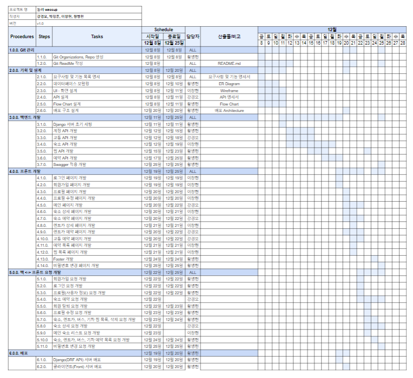</a>

<div align="right">

[목차](#목차)

</div>

## 3. 배포 URL 및 아키텍쳐
### 3-1. 배포 URL
#### [Django(API) 서버]  
https://api.nolreowassup.shop/

#### [클라이언트(Frontend) 서버]  
https://www.nolreowassup.shop/
```
배포 테스트 계정
ID : test@test.com
PW : test123!@#
```

### 3-2. 배포 아키텍쳐

<div align="right">

[목차](#목차)

</div>

## 4. 요구사항 및 기능 명세

<div align="right">

[목차](#목차)

</div>

## 5. 화면 설계(Wireframe)
<a href="https://ovenapp.io/project/A2aAFGcE1yeBkiGoZkLPzmfXP2IdoMQF#yRAOo">화면설계 테스트 페이지 바로가기</a> <br/>

<br/>

|||
|-|-|
|로그인 화면|회원 가입 화면|
|프로필 화면|프로필 수정 화면|
|숙소 상세1 화면|숙소 상세2 화면|
|숙소 상세3 화면|숙소 목록1 화면|
|숙소 목록2 화면|숙소 예약 화면|
|렌트카 상세1 화면|렌트카 상세2 화면|
|렌트카 상세3 화면|렌트카 목록1 화면|
|렌트카 목록2 화면|렌트카 예약 화면|
|교통 상세1 화면|교통 상세2 화면|
|교통 목록1 화면|교통 목록2 화면|
|예약 상세 화면|예약 수정 화면|
|예약 목록 화면|찜 목록1 화면|
|찜 목록2 화면||
<div align="right">

[목차](#목차)

</div>

## 6. 데이터베이스 모델링(ER Diagram)
  
<div align="right">

[목차](#목차)

</div>

## 7. API 명세서
[Swagger](https://api.nolreowassup.shop/api/schema/swagger-ui/)  
  
|app: account|HTTP Method|설명|로그인 권한 필요|작성자 권한 필요|Admin 권한|
|:-|:-|:-|:-:|:-:|:-:|
|'signup/'|POST|회원가입|||
|'login/'|POST|로그인(토큰 발급)|||
|'refresh/'|POST|만료 토큰 재발급|||
|'\<int:pk\>/'|GET|프로필 조회|✅|✅||
|'\<int:pk\>/'|PATCH|프로필 수정|✅|✅||
|'\<int:pk\>/'|DELETE|회원 탈퇴|✅|✅||
|'password/'|PATCH|회원 비밀번호 변경|✅|✅||
<br>  

|app: lodging|HTTP Method|설명|로그인 권한|작성자 권한|Admin 권한|
|:-|:-|:-|:-:|:-:|:-:|
|''|POST|숙소 생성 |||✅|
|'\<int:lodging_pk\>/'|GET|숙소 상세||||
|''|GET|숙소 목록||||
|'\<int:lodging_pk\>/'|PATCH|숙소 정보 수정|||✅|
|'\<int:lodging_pk\>/'|DELETE|숙소 삭제|||✅|
|'images/'|POST|숙소 이미지 생성|||✅|
|'images/'|GET|숙소 이미지 목록||||
|'images/\<int:image_pk\>/'|GET|숙소 이미지 상세||||
|'images/\<int:image_pk\>/'|PATCH|숙소 이미지 수정|||✅|
|'images/\<int:image_pk\>/'|DELETE|숙소 이미지 삭제|||✅|
|'amenity/'|POST|숙소 편의시설 생성|||✅|
|'amenity/\<int:amentiy_pk\>/'|GET|숙소 편의시설 상세||||
|'amenity/\<int:amentiy_pk\>/'|PATCH|숙소 편의시설 수정|||✅|
|'amenity/\<int:amentiy_pk\>/'|DELETE|숙소 편의시설 삭제|||✅|
|'roomtype/'|POST|객실 생성|||✅|
|'roomtype/\<int:roomtype_pk\>/'|GET|객실 상세||||
|'roomtype/\<int:roomtype_pk\>/'|PATCH|객실 수정|||✅|
|'roomtype/\<int:roomtype_pk\>/'|DELETE|객실 삭제|||✅|
|'roomtype/image/'|POST|객실 이미지 생성|||✅|
|'roomtype/image/\<int:roomtype_pk\>/'|GET|객실 이미지 상세||||
|'roomtype/image/\<int:roomtype_pk\>/'|PATCH|객실 이미지 수정|||✅|
|'roomtype/image/\<int:roomtype_pk\>/'|DELETE|객실 이미지 삭제|||✅|
|'review/'|POST|리뷰 생성|✅|||
|'review/'|GET|리뷰 목록||||
|'review/\<int:review_pk\>/'|PATCH|리뷰 수정|✅|✅||
|'review/\<int:review_pk\>/'|DELETE|리뷰 삭제|✅|✅||
|'review/image/'|POST|리뷰 이미지 생성|✅|||
|'review/image/'|GET|리뷰 이미지 목록||||
|'review/image/\<int:review_pk\>/'|PATCH|리뷰 이미지 수정|✅|✅||
|'review/image/\<int:review_pk\>/'|DELETE|리뷰 이미지 삭제|✅|✅||
|'review/\<int:review_pk\>/comment/'|POST|리뷰 답글 생성|✅|||
|'review/\<int:review_pk\>/comment/'|GET|리뷰 답글 목록||||
|'review/\<int:review_pk\>/comment/\<int:comment_pk\>/'|PATCH|리뷰 답글 수정|✅|✅||
|'review/\<int:review_pk\>/comment/\<int:comment_pk\>/'|DELETE|리뷰 답글 삭제|✅|✅||
<br>

|app: traffic|HTTP Method|설명|로그인 권한|작성자 권한|Admin 권한|
|:-|:-|:-|:-:|:-:|:-:|
|'bus/'|POST|버스 생성 |||✅|
|'bus/\<int:bus_pk\>/'|GET|버스 상세||||
|'bus/'|GET|버스 목록||||
|'bus/\<int:bus_pk\>/'|PUT|버스 정보 수정|||✅|
|'bus/\<int:bus_pk\>/'|DELETE|버스 삭제|||✅|
|'train/'|POST|기차 생성|||✅|
|'train/\<int:train_pk\>/'|GET|기차 상세||||
|'train/'|GET|기차 목록||||
|'train/\<int:train_pk\>/'|PUT|기차 정보 수정|||✅|
|'train/\<int:train_pk\>/'|DELETE|기차 삭제|||✅|
|'rentalcar/'|POST|렌트카 생성 |||✅|
|'rentalcar/\<int:rentalcar_pk\>/'|GET|렌트카 상세||||
|'rentalcar/'|GET|렌트카 목록||||
|'rentalcar/\<int:rentalcar_pk\>/'|PUT|렌트카 정보 수정|||✅|
|'rentalcar/\<int:rentalcar_pk\>/'|DELETE|렌트카 삭제|||✅|
|'review/'|POST|리뷰 생성|✅|||
|'review/'|GET|리뷰 목록||||
|'review/\<int:review_pk\>/'|PUT|리뷰 수정|✅|✅||
|'review/\<int:review_pk\>/'|DELETE|리뷰 삭제|✅|✅||
|'reply/'|POST|답글 생성||✅|✅|
|'reply/'|GET|답글 목록||||
|'reply/\<int:reply_pk\>/'|PUT|답글 수정||✅|✅|
|'reply/\<int:reply_pk\>/'|DELETE|답글 삭제||✅|✅|
<br>

|app: pick|HTTP Method|설명|로그인 권한|작성자 권한|Admin 권한|
|:-|:-|:-|:-:|:-:|:-:|
|'lodging/'|POST|숙소 찜 생성|✅|||
|'lodging/'|GET|숙소 찜 목록|✅|✅||
|'lodging/\<int:pick_pk\>/'|DELETE|숙소 찜 삭제|✅|✅||
|'bus/'|POST|버스 찜 생성|✅|||
|'bus/'|GET|버스 찜 목록|✅|✅||
|'bus/\<int:pick_pk\>/'|DELETE|버스 찜 삭제|✅|✅||
|'train/'|POST|기차 찜 생성|✅|||
|'train/'|GET|기차 찜 목록|✅|✅||
|'train/\<int:pick_pk\>/'|DELETE|기차 찜 삭제|✅|✅||
|'rental_car/'|POST|렌트카 찜 생성|✅|||
|'rental_car/'|GET|렌트카 찜 목록|✅|✅||
|'rental_car/\<int:pick_pk\>/'|DELETE|렌트카 찜 삭제|✅|✅||
|''|GET|전체 찜 목록|✅|✅||
<br>

|app: reservation|HTTP Method|설명|로그인 권한|작성자 권한|Admin 권한|
|:-|:-|:-|:-:|:-:|:-:|
|'lodging/'|POST|숙소 예약 생성|✅|||
|'lodging/'|GET|숙소 예약 목록|✅|✅||
|'lodging/\<int:reservation_pk\>/'|PATCH|숙소 예약 수정|✅|✅||
|'lodging/\<int:reservation_pk\>/'|DELETE|숙소 예약 삭제|✅|✅||
|'bus/'|POST|버스 예약 생성|✅|||
|'bus/'|GET|버스 예약 목록|✅|✅||
|'bus/\<int:reservation_pk\>/'|DELETE|버스 예약 삭제|✅|✅||
|'train/'|POST|기차 예약 생성|✅|||
|'train/'|GET|기차 예약 목록|✅|✅||
|'train/\<int:reservation_pk\>/'|DELETE|기차 예약 삭제|✅|✅||
|'rental_car/'|POST|렌트카 예약 생성|✅|||
|'rental_car/'|GET|렌트카 예약 목록|✅|✅||
|'rental_car/\<int:reservation_pk\>/'|PATCH|렌트카 예약 수정|✅|✅||
|'rental_car/\<int:reservation_pk\>/'|DELETE|렌트카 예약 삭제|✅|✅||
<div align="right">

[목차](#목차)

</div>

## 8. 프로젝트 구조
### 8-1. BE 프로젝트 구조
```
📦nolreo_wassup_BE
 ┣ 📂.git
 ┣ 📂.github
 ┃ ┗ 📂workflows
 ┃ ┃ ┗ 📜main.yml
 ┣ 📂account
 ┃ ┣ 📜managers.py
 ┃ ┣ 📜models.py
 ┃ ┣ 📜serializers.py
 ┃ ┣ 📜tests.py
 ┃ ┣ 📜urls.py
 ┃ ┣ 📜views.py
 ┣ 📂lodging
 ┃ ┣ 📂tests
 ┃ ┣ 📜models.py
 ┃ ┣ 📜serializers.py
 ┃ ┣ 📜urls.py
 ┃ ┣ 📜views.py
 ┣ 📂nolreo_wassup
 ┃ ┣ 📜settings.py
 ┃ ┣ 📜urls.py
 ┣ 📂pick
 ┃ ┣ 📜models.py
 ┃ ┣ 📜serializers.py
 ┃ ┣ 📜tests.py
 ┃ ┣ 📜urls.py
 ┃ ┣ 📜views.py
 ┣ 📂reservation
 ┃ ┣ 📜models.py
 ┃ ┣ 📜serializers.py
 ┃ ┣ 📜tests.py
 ┃ ┣ 📜urls.py
 ┃ ┣ 📜views.py
 ┣ 📂static
 ┃ ┗ 📂assets
 ┃ ┃ ┗ 📂images
 ┣ 📂traffic
 ┃ ┣ 📂tests
 ┃ ┣ 📜models.py
 ┃ ┣ 📜serializers.py
 ┃ ┣ 📜urls.py
 ┃ ┣ 📜views.py
 ┣ 📂utils
 ┃ ┣ 📜permissions.py
 ┃ ┗ 📜test_remove_tools.py
 ┣ 📜.env
 ┣ 📜.gitignore
 ┣ 📜CONVENTION.md
 ┣ 📜db.sqlite3
 ┣ 📜manage.py
 ┣ 📜README.md
 ┗ 📜requirements.txt
```
### 8-2. FE 프로젝트 구조
```
📦nolreo_wassup_FE
 ┣ 📂.git
 ┣ 📂.github
 ┃ ┗ 📂workflows
 ┃ ┃ ┗ 📜main.yml
 ┣ 📂css
 ┃ ┣ 📂custom
 ┃ ┃ ┣ 📜index.css
 ┃ ┃ ┗ 📜lodging_details.css
 ┣ 📂images
 ┣ 📂js
 ┃ ┣ 📂custom
 ┃ ┃ ┣ 📜changepassword.js
 ┃ ┃ ┣ 📜common.js
 ┃ ┃ ┣ 📜editprofile.js
 ┃ ┃ ┣ 📜index.js
 ┃ ┃ ┣ 📜lodging_details.js
 ┃ ┃ ┣ 📜lodging_reservation.js
 ┃ ┃ ┣ 📜login.js
 ┃ ┃ ┣ 📜main_lodging_list.js
 ┃ ┃ ┣ 📜main_rentcar_list.js
 ┃ ┃ ┣ 📜main_transport_list.js
 ┃ ┃ ┣ 📜pick_list.js
 ┃ ┃ ┣ 📜profile.js
 ┃ ┃ ┣ 📜rentalcar_details.js
 ┃ ┃ ┣ 📜rentalcar_reservation.js
 ┃ ┃ ┣ 📜reservation_list.js
 ┃ ┃ ┣ 📜signup.js
 ┃ ┃ ┗ 📜traffic_reservation.js
 ┣ 📂plugins
 ┣ 📜.gitignore
 ┣ 📜changepassword.html
 ┣ 📜editprofile.html
 ┣ 📜index.html
 ┣ 📜lodging-details.html
 ┣ 📜lodging_reservation.html
 ┣ 📜login.html
 ┣ 📜pick_list.html
 ┣ 📜profile.html
 ┣ 📜rental.html
 ┣ 📜rentalcar-details.html
 ┣ 📜rentalcar_reservation.html
 ┣ 📜reservation_list.html
 ┣ 📜signup.html
 ┣ 📜traffic_reservation.html
 ┗ 📜transport.html
```
<div align="right">

[목차](#목차)

</div>

## 9. UI  
|||
|:-:|:-:|
|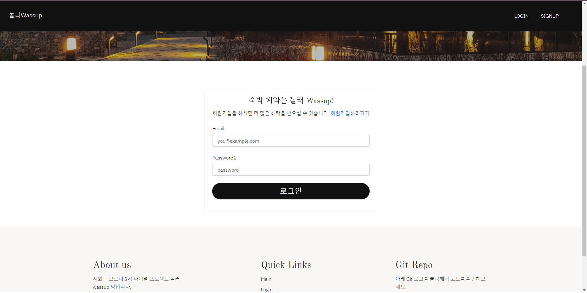로그인 화면|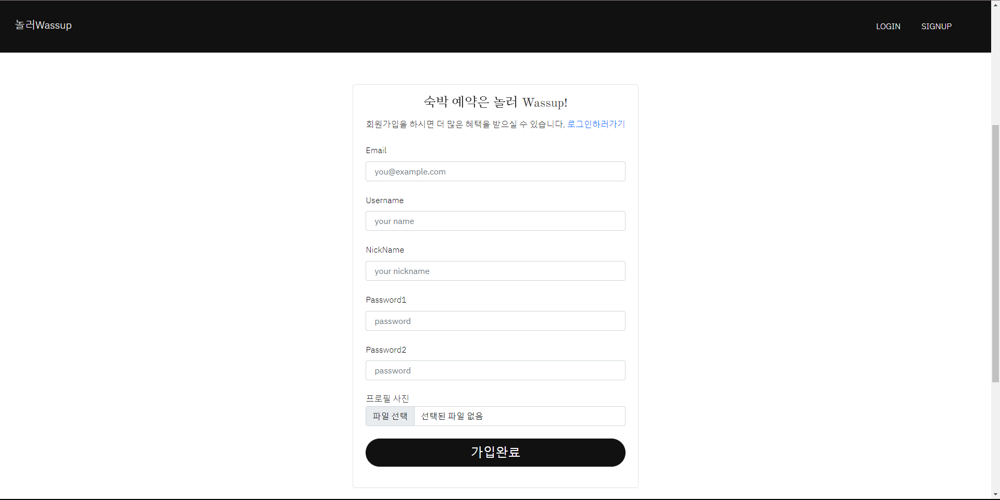회원 가입 화면|
|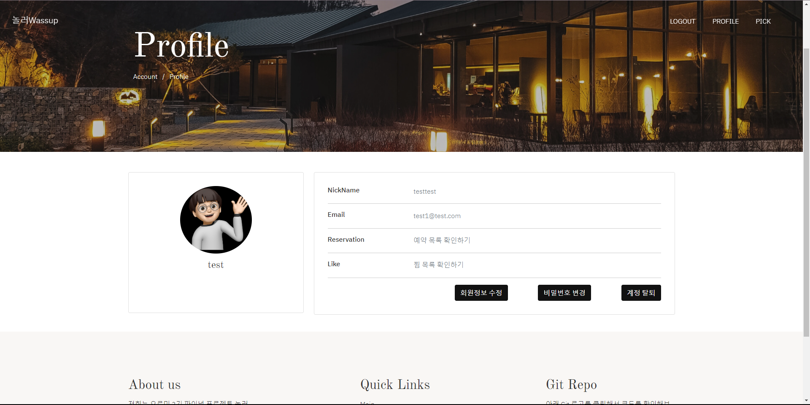프로필 화면|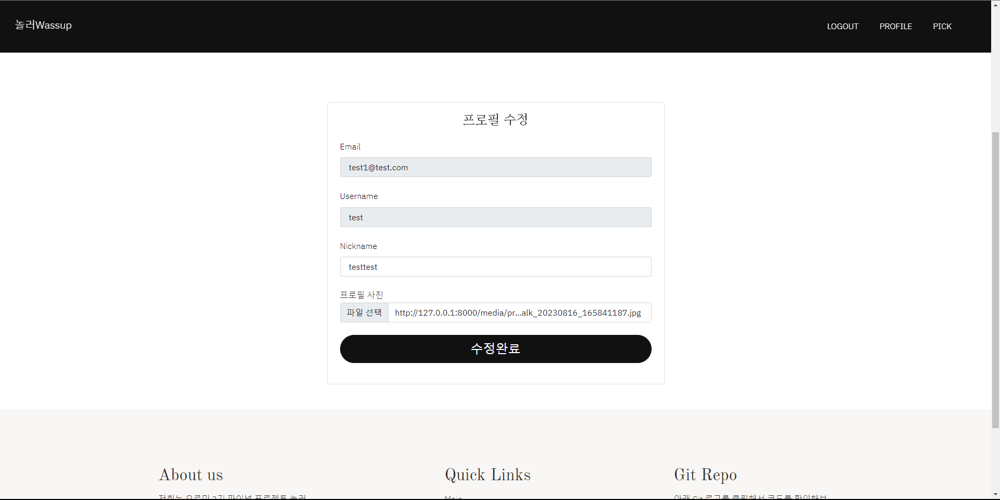프로필 수정 화면|
|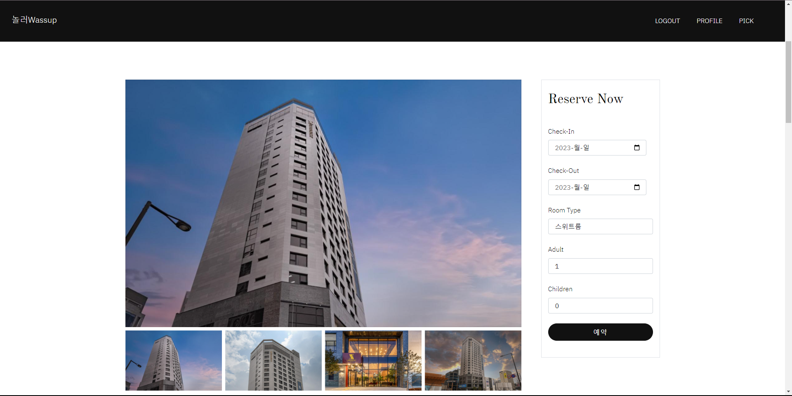숙소 상세1 화면|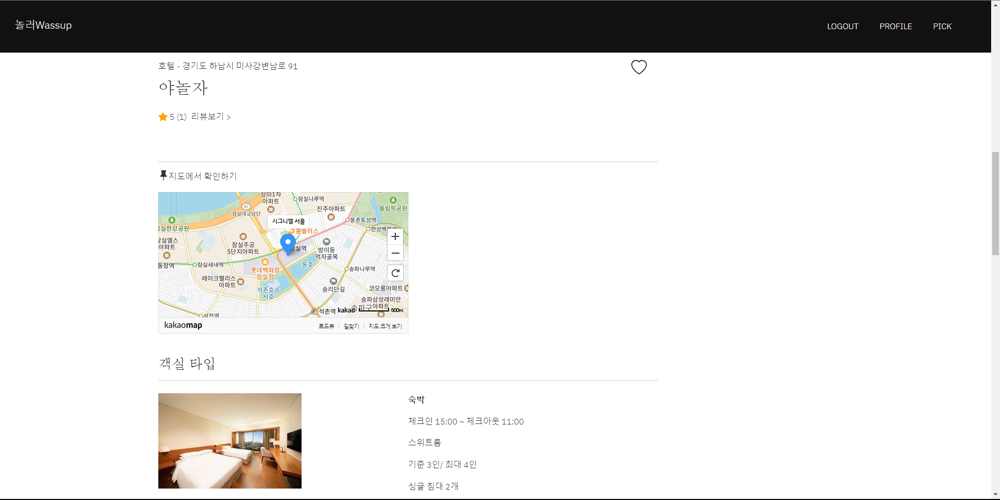숙소 상세2 화면|
|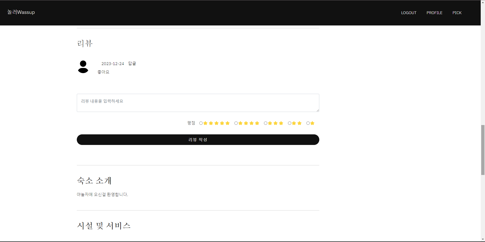숙소 상세3 화면|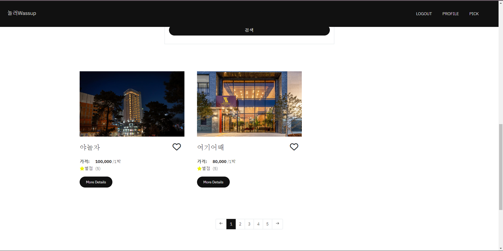숙소 목록 화면|
|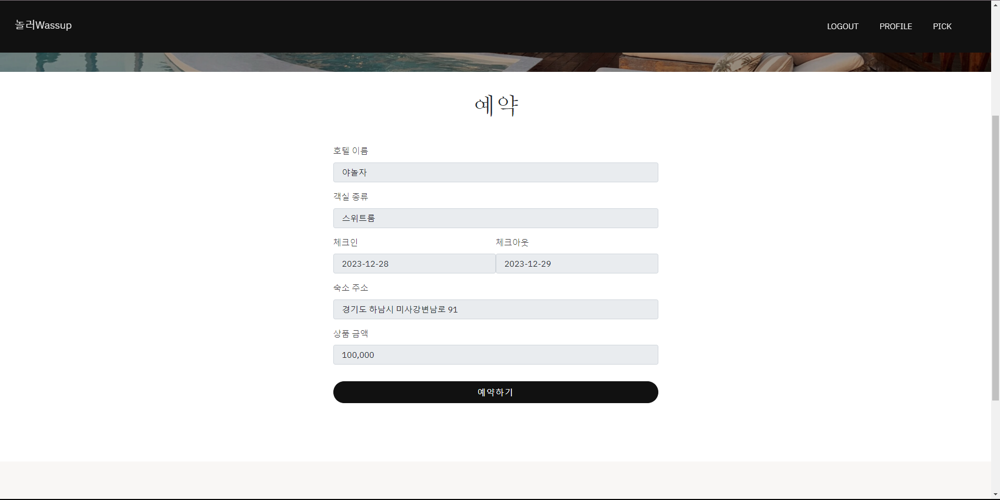숙소 예약 화면|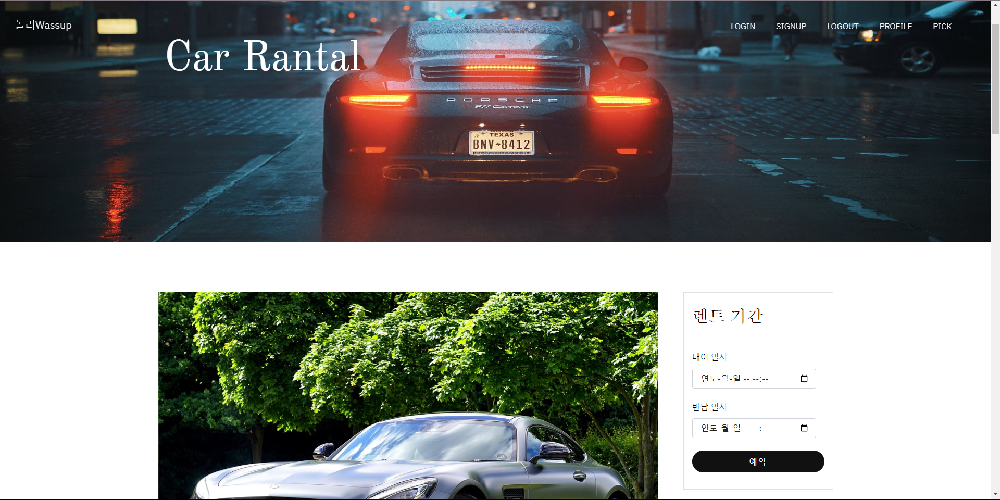렌트카 상세1 화면|
|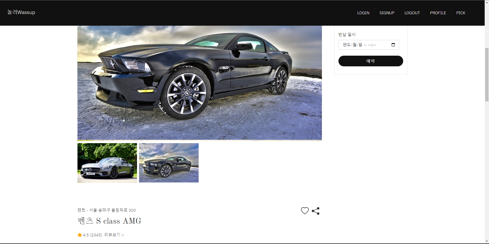렌트카 상세2 화면|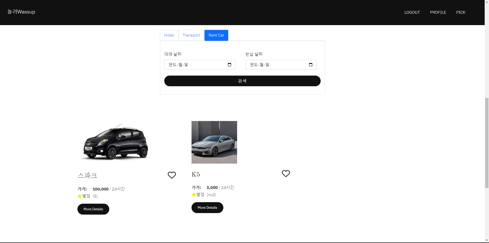렌트카 목록1 화면|
|렌트카 예약 화면|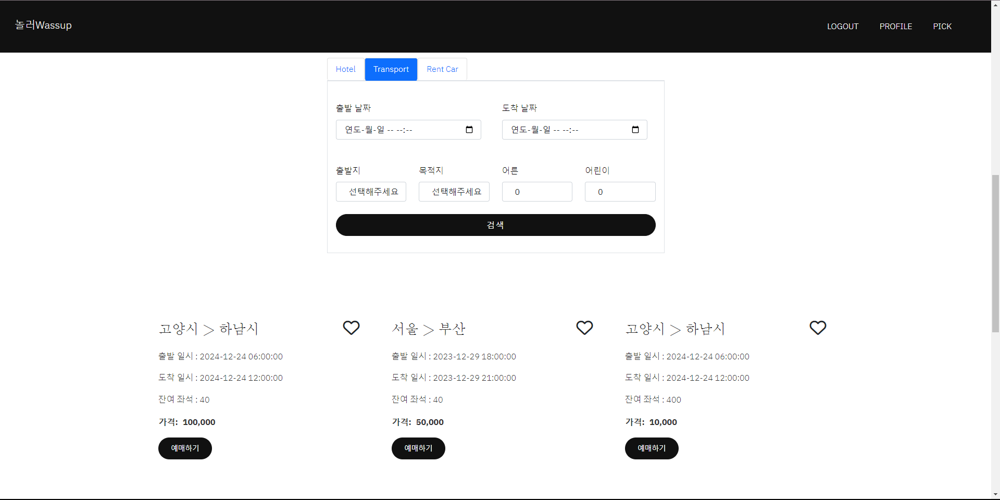교통 목록 화면|
|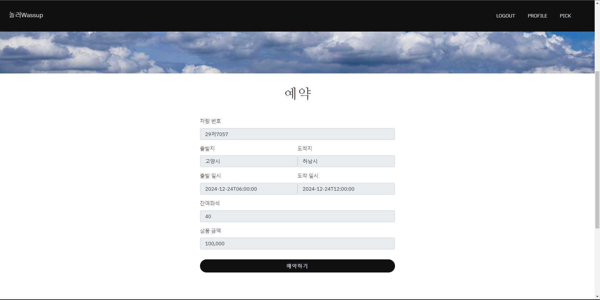교통 예약 화면|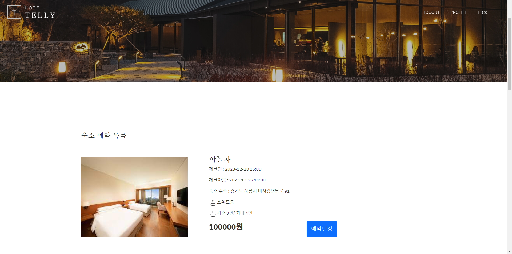예약 목록1 화면|
|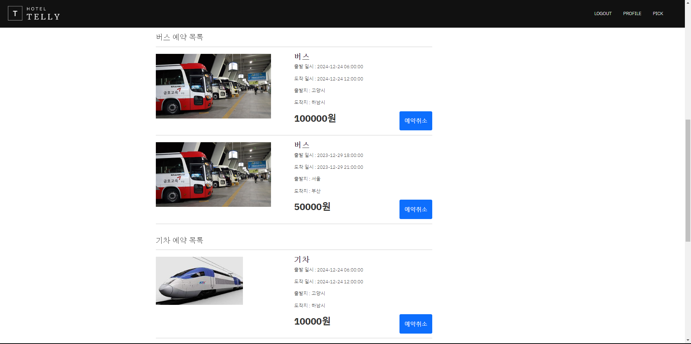예약 목록2 화면|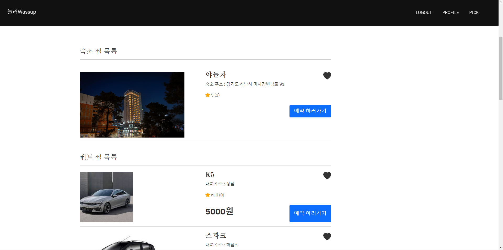찜 목록1 화면|
|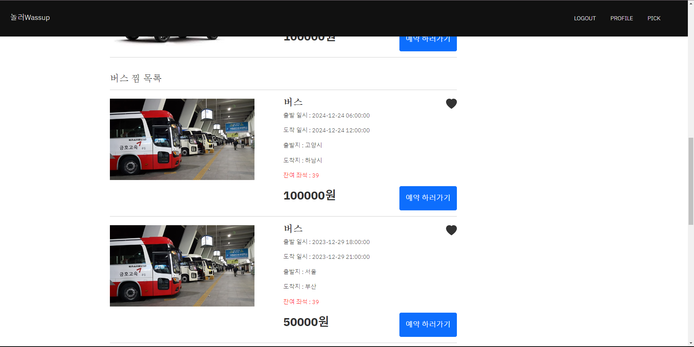찜 목록2 화면|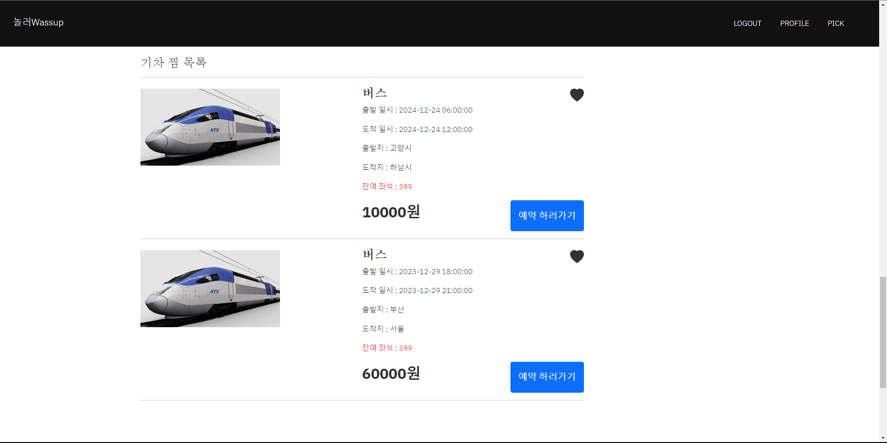찜 목록3 화면|
<div align="right">

[목차](#목차)

</div>

## 10. 주요 기능
### 10-1. 숙소 예약 관련 기본 기능 및 찜 기능
<br/>
- 등록되어 있는 숙소 목록을 제공하며, 검색 기능을 통해 검색 대상 예약일에 예약이 비어있는 객실을 보유한 숙소 목록을 출력해주는 기능도 제공합니다.
- 제공된 숙소 목록들 중 이후 다시 보고 싶은 숙소 데이터는 찜 기능을 통해서 찜 추가 후 개인 찜 목록 페이지를 통해 다시 확인할 수 있습니다.
- 목록에서 각 숙소 별로 상세 페이지를 제공하여 해당 숙소가 보유 중인 객실 데이터를 출력해주며, 보유 중인 숙박 편의 시설과 대상 숙소에 등록된 리뷰 및 리뷰에 대한 댓글을 출력해주는 기능을 제공합니다.
- 이렇게 제공된 기능들을 통해 특정 숙소의 객실을 예약할 수 있는 기능을 제공하며, 
위의 기능들 중 예약, 찜, 리뷰, 댓글 기능은 JWT 토큰 인증 방식을 이용하여 로그인한 사용자들을 대상으로 제공되며, 해당 데이터들의 수정 기능은 데이터 작성자만이 가능하도록 구현하였습니다.

### 10-2. 렌트카 예약 관련 기본 기능 및 찜 기능  
<br/>
- 등록되어 있는 렌터카 목록을 제공하며, 검색 기능을 통해 검색 대상 예약일에 예약이 비어있는 렌터카 목록을 출력해주는 기능도 제공합니다.
- 제공된 렌터카 목록들 중 이후 다시 보고 싶은 렌터카 데이터는 찜 기능을 통해서 찜 추가 후 개인 찜 목록 페이지를 통해 다시 확인할 수 있습니다.
- 목록에서 각 렌터카 별 상세 페이지를 제공하여 해당 렌터카에 등록된 리뷰 및 리뷰에 대한 댓글을 출력해주는 기능을 제공합니다.
- 이렇게 제공된 기능들을 통해 특정 렌터카를 예약할 수 있는 기능을 제공하며, 예약한 렌터카는 예약 목록을 통해 확인할 수 있습니다.
- 위의 기능들 중 예약, 찜, 리뷰, 댓글 기능은 JWT 토큰 인증 방식을 이용하여 로그인한 사용자들을 대상으로 제공되며, 해당 데이터들의 수정 기능은 데이터 작성자만이 가능하도록 구현하였습니다.

### 10-3. 교통 예약, 찜 기능
<br/>
- 등록되어 있는 교통(버스, 기차) 목록을 제공하며, 검색 기능을 통해 해당 검색 조건 을 만족하는 버스, 기차의 목록을 출력해주는 기능도 제공합니다.
- 제공된 교통 목록들 중 이후 다시 보고 싶은 교통 데이터는 찜 기능을 통해서 찜 추가 후 개인 찜 목록 페이지를 통해 다시 확인할 수 있습니다.
- 목록에서 각 교통 목록 별 상세 페이지를 제공하여 특정 교통 수단을 예약할 수 있는 기능을 제공하며, 예약한 교통 목록은 예약 목록을 통해 확인할 수 있습니다.
- 위의 기능들 중 예약, 찜 기능은 JWT 토큰 인증 방식을 이용하여 로그인한 사용자들을 대상으로 제공되며, 해당 데이터들의 수정 기능은 데이터 작성자만이 가능하도록 구현하였습니다.

### 10-4. 계정 관련 기본 기능
<br/>
- 회원가입 기능 : 서비스를 사용하기 위한 계정 생성을 위한 기능으로 입력 값들의 유효성 검사를 제공하여 유효성을 만족하는 입력에 대해서 회원가입이 정상 처리됩니다.
- 로그인 기능 : JWT 토큰 인증 방식을 이용하기 위해 정상 로그인이 된 경우 서버에서 access token, refresh token, user_id를 응답하여 LocalStorage에 저장하여 이후 서비스에 사용할 수 있도록 개발하였습니다.
- 프로필 기능 : 유저의 기본 정보를 확인할 수 있는 기능으로 프로필을 통해 해당 유저가 찜 및 예약한 목록들을 확인하고 찜한 목록을 취소할 수 있는 기능도 제공합니다.
- 프로필 수정 및 비밀번호 변경 기능 : 이메일과 같이 ID로 사용되는 값을 제외한 닉네임과 비밀번호를 변경할 수 있는 기능을 제공하며, 기본적인 유효성 검사를 확인한 후 변경할 수 있도록 개발하였습니다.

<div align="right">

[목차](#목차)

</div>

## 11. 개발 이슈
### 11-1. GitHub Actions 설정 중 SECRET KEY 설정 오류
#### 11-1-1. 문제 원인
```shell
django.core.exceptions.ImproperlyConfigured: The SECRET_KEY setting must not be empty.
github action
```
- GitHub Actions을 설정하던 중 위와 같은 오류가 발생하게 되었는데, 오류를 해석해 보니 django를 실행할 때 사용되는 SECRET_KEY가 없어서 생기는 오류였다.
- 하지만 GitHub setting에서 시크릿 키로 설정해주었는데도 해당 오류가 발생하는게 의문이었습니다. 추가적으로 GitHub Actions을 설정한 코드를 확인하며 찾은 원인은 테스트 코드에 있었습니다.
- 테스트 코드를 실행하기 위해서는 GitHub Actions을 통해 설정한 가상환경에도 SECRET_KEY가 따로 세팅이 되어야 테스트 코드를 위한 Django 실행에 오류가 생기지 않을 수 있었기 때문에 오류가 발생하였던 것입니다
#### 11-1.2. 해결 방법
```yml
# 수정 전 코드
- name: Run Tests
    run: |
        python manage.py test
# 수정 후 코드
- name: Run Tests
    run: |
        python manage.py test
    env :
        SECRET_KEY: ${{ secrets.SECRET_KEY }}
        DEBUG: ${{ secrets.DEBUG }}
```
- 원인 확인 위와 같이 작성했던 코드에 환경 변수를 적용하는 코드를 추가해주어 테스트 코드 실행 시 SECRET_KEY를 적용하여 해결할 수 있었습니다.

### 11-2. GitHub Actions 설정 중 인증 실패 오류
#### 11-2-1. 문제 원인
```shell
ssh: handshake failed: ssh: unable to authenticate, attempted methods [none password], no supported methods remain
```
- 기존에 GitHub Actions 설정 시 사용했던 username과 password를 기반으로 하는 설정을 하는 경우 위와 같은 오류가 발생하는 상황이었습니다.
- 해당 오류는 인증 과정 중 서버가 해당 인증 방법을 지원하지 않아 발생하는 오류였습니다.
#### 11-2-2. 해결 방법
- 오류 해결을 위해서 key를 사용하는 인증 방법을 적용하였습니다.
- key를 사용하는 인증을 위해서는 현재 프로젝트에서 사용하는 EC2 서버에서 받은 pem 파일 내의 key 값을 GitHub setting에서 키 값을 'PEM_SECRET'으로 하는 시크릿 키로 설정해주었습니다.
```yml
# 수정 전 코드
- name: 서버 배포
    uses: appleboy/ssh-action@master
    with:
        host: ${{ secrets.SERVER_HOST }}
        username: ${{ secrets.SERVER_USER }}
        password: ${{ secrets.SERVER_PASSWORD }}
        script: |
# 수정 후 코드
- name: 서버 배포
    uses: appleboy/ssh-action@master
    with:
        host: ${{ secrets.SERVER_HOST }}
        username: ${{ secrets.SERVER_USER }}
        key: ${{ secrets.PEM_SECRET }}
        script: |
```
- 이후 위와 같이 기존의 password로 서버에 접근하는 방식에서 key로 접근하는 방식으로 GitHub Action 코드를 변경하여 문제를 해결할 수 있었습니다.

### 11-3. 숙소 API CRUD 테스트 케이스 작성 중 에러
#### 11-3-1. 문제 원인
- lodging 앱 테스트 중 `/lodging/images` 경로로 POST 요청시 400 error가 발생하였습니다.
- 에러의 원인은 lodging 앱의 urls.py에서 설정한 router의 문제였습니다. 아래와 같이 라우터 하나에 두개의 ViewSet을 등록하는 경우 처음 설정한 ViewSet이 /lodging으로 시작하는 모든 URL 요청을 받아 처리하기 때문에 `/lodging/imges` 요청이 두 번째 ViewSet에서 처리되지 않았던 것이었습니다.
```python
router = DefaultRouter()
router.register('', views.LodgingViewSet)
router.register('images', views.LodgingImageViewSet)
```

#### 11-3-2. 해결 방법
- 해당 에러는 `router.register('', views.LodgingViewSet)`보다 `router.register('images', views.LodgingImageViewSet)`이 URL 요청을 먼저 받게 해주는 방법이 필요했기 때문에 아래 코드와 같이 라우터에 ViewSet을 설정하는 위치를 변경해주어 정상동작을 확인할 수 있었습니다.
```python
router = DefaultRouter()
router.register('images', views.LodgingImageViewSet)
router.register('', views.LodgingViewSet)
```

### 11-4. Admin 권한으로만 요청 가능한 수정 관련 API에 patch 메소드가 허용되는 문제
#### 11-4-1. 문제 원인
- 숙소 관련 테스트 중 일반사용자와 로그인하지 않은 사용자가 수정이 불가능한지 확인하는 테스트를 진행하는 중 put 메소드를 사용했을때는 HTTP 코드 401 뜨는것을 확인했지만, 똑같인 401 응답이 와야하는 patch 메소드로 바꾸면 HTTP 코드가 200이 나오는 문제가 있었습니다.
- 이 문제는 숙소 ViewSet의 get_permissions에서 아래와 같이 권한을 준 것이 원인이었습니다.
```python
def get_permissions(self):
    if self.action in ['create', 'update', 'destroy']:
        permission_classes = [IsAdminUser]
    else:
        permission_classes = [AllowAny]
    return [permission() for permission in permission_classes]
```
- Admin 권한으로 제한하는 IsAdminUser가 적용되는 update는 put 요청을 받고, patch 요청은 partial_update에서 처리하기 때문에 patch 요청에 대해서 정상 응답을 한 것이었습니다.

#### 11-4-2. 해결 방법
- IsAdminUser 권한을 주는 코드 중 아래와 같이 partial_update를 대상에 추가시켜 정상 동작할 수 있도록 하였습니다.
```python
def get_permissions(self):
    if self.action in ['create', 'update', 'partial_update', 'destroy']:
        permission_classes = [IsAdminUser]
    else:
        permission_classes = [AllowAny]
    return [permission() for permission in permission_classes]
```
- ModelViewSet에서 patch는 partial_update에서 처리되기 때문에, patch에 대한 권한 제한을 적용할 때는 위의 코드와 같이 적용해주어야할 것입니다.

### 11-5. 배포 이후 CORS 설정 없이도 Client <-> API 서버간 정상 통신이 되는 현상
#### 11-5-1. 이슈 상황
- 배포가 완료된 상태에서 Client 서버의 주소값이 Django 세팅의 CORS 화이트 리스트에 등록되지 않은 상태에서 API 서버에 접근하려 할 때 생긴 상황이였습니다.
- 현 상황에서 CORS 화이트리스트에 등록되지 않은 서버의 요청인 Client 서버의 요청은 CORS 정책에 의해 거부되어야 하지만 정상적으로 요청이 되어 응답을 받았습니다.

#### 11-5-2. 확인된 이슈 원인
- 확인된 원인은 서브 도메인으로 생성된 API 서버 주소 https://api.nolreowassup.shop/와 Client 서버 주소 https://www.nolreowassup.shop/가 동일한 도메인을 가지기 때문이라는 것이였습니다.
- CORS는 동일 출처 정책을 갖기 때문에 자신과 동일한 도메인에 한해서만 요청을 허용하고 처리해주고, 기존에 알고 있던 IP 주소와 PORT의 동일을 비교하는 것 뿐만 아니라 동일 도메인도 동일 출처로 보아서 요청을 허용함을 알 수 있게 되었습니다.

### 11-6. CSRF 검증 실패(배포 서버 Admin) 에러
#### 11-6-1. 문제 원인
- 서비스 배포 후 Django 어드민에 로그인 중 'CSRF 검증 실패' error가 발생하였습니다.
- 원인은 CsrfViewMiddleware에서 보안상 이유로 CSRF 쿠키가 확인 되지 않으면 접근을 차단했기 때문이었습니다.

#### 11-6-2. 해결 방법
- settings.py 에서 csrf MIDDLEWARE 를 주석 처리하여 해당 미들웨어를 사용 하지않는 방법을 보았지만, CSRF의 보안 기능을 유지하며 에러를 해결 할 수 있는 방법이 옳다고 생각하였습니다.
- 공식 문서를 확인해보니 CSRF_TRUSTED_ORIGINS, CSRF_COOKIE_SECURE, SESSION_COOKIE_SECURE 3가지 설정으로 아래 코드와 같이 화이트리스트 설정을 해줄 수 있다는 것을 확인했습니다.
```python
# nolreo_wassup > settings.py
CSRF_TRUSTED_ORIGINS = [
        "http://nolreowassup.shop",
        "https://nolreowassup.shop",
        "http://api.nolreowassup.shop",
        "https://api.nolreowassup.shop",
        "http://www.nolreowassup.shop",
        "https://www.nolreowassup.shop",]
CSRF_COOKIE_SECURE = True
SESSION_COOKIE_SECURE = True
```
```
참고한 공식 문서 - https://docs.djangoproject.com/en/5.0/ref/settings/#csrf-trusted-origins
```

<div align="right">

[목차](#목차)

</div>

## 12. 개발 회고
### 👩🏻‍💻 강경모
#### 인원 부족을 극복한 프로젝트
```markdown
 프로젝트를 진행하면서 팀 프로젝트는 처음이라 어떻게 진행해야 할지 잘 몰랐지만, 다른 팀원들과 함께 계획을 잘 세워 나갔습니다. 
 그러다 한 팀원이 사정으로 인해 프로젝트에서 빠지게 되었고, 처음에는 그 빈자리가 크게 느껴지지 않았으나 시간이 지날수록 한 명의 부재가 많이 느껴졌습니다. 특히 JavaScript로 API를 연동할 때 오류가 많이 발생하고 원하는 대로 작동하지 않아 고생을 많이 했습니다. 하지만 다른 팀원들이 코드를 같이 봐주며 많은 도움을 주어 프로젝트를 잘 마칠 수 있었습니다.
```

#### TDD를 사용한 개발
```
 팀 프로젝트에서 TDD(Test-Driven Development)를 통해 백엔드 개발을 하였는데 처음 사용하다 보니 테스트 코드를 짜는데서부터 많이 막히기도 하였지만 검색과 팀원들의 도움으로 개발을 이어나갔습니다. TDD를 사용하면서 생각보다 시간이 많이 투자되는 것을 느끼며 이게 좋은 방법이 맞는지 느꼈지만 TDD가 완성된 후 API 연동을 할 때 제 코드가 아니더라도 다른 팀원분들의 테스트 코드를 보며 좀 더 연동하기가 좀 더 쉬웠고 에러를 잡는 것도 TDD를 사용했을 때와 안 했을 때의 차이를 느꼈습니다.
```

#### GitHub을 통한 협업
```
 팀으로 프로젝트를 진행하며 Organizations를 통해 팀 프로젝트 레포를 만들어 Issues와 Pull requests, Project를 통해 협업을 하였는데 Issues를 통해 빠르게 개발 현황을 확인을 할 수 도 있고 Pull requests를 통해 다른 팀원들의 코드를 실제로 눈으로 보며 확인을 하다 보니 좀 더 신뢰가 생겼습니다. 그러다 보니 제 코드도 팀원들이 피드백을 해주며 더 나은 코드가 되는 것을 보고 협업에 대한 중요성을 느꼈습니다.
```


### 👩🏻‍💻 이창현
#### 다음 프로젝트에도 적용하고 싶은 개발 방법 TDD
```
 기획 단계에서 테스트 주도 개발을 기반으로  개발하기로 결벙된 후 주어진 요구 사항을 기반으로 '테스트 코드 작성' -> '개발' -> '리팩토링' 단계를 거쳐서 개발했습니다.
처음에는 개발 속도가 목표한 시간보다 느리게 진행 된다고 생각했지만, 목표한 테스트 코드가 전부 완성되고 난 후 API 연동 작업을 위해 다른 팀원이 개발한 API를 사용해야 하는 일이 생겼는데 테스트 코드를 확인하며 API 연동을 더 쉽고 빠르게 할 수 있었고, 에러가 발생하는 경우도 크게 줄었다고 느꼈습니다.
```

#### Git Issues, Git Project
```
 팀으로 프로젝트를 진행하며 프로젝트 진행 간에 커뮤니케이션 문제를 해결하기 위해 깃 이슈와 프로젝트를 사용하여 협업을 했고, 정말 좋은 선택이었다는 생각을 했습니다.
 모든 문제들에 대해 팀원들이 계속 만나 커뮤니케이션을 할 수 없었기에 ＇개발 중인 기능', '문제 해결＇ 등의 단위로 깃 이슈를 등록하기로 했고, 생성된 이슈를 통해 Todo, In progress, Done 순으로 관리하여서, 문제가 생겼을 때 깃 이슈를 보며 빠르게 개발 현황을 확인 할 수 있었고, 지속적으로 발생한 이벤트를 한 눈에 확인 할 수 있어 협업에 도움이 되었다고 느꼈습니다.
```

#### 마지막으로
```
 팀으로 협업하며 프로젝트를 하는건 처음이라 혼자 개발할때는 몰랐던 좋은 점을 많이 느낄 수 있었고, 그 중 트러블 슈팅에서 가장 큰 빛을 봤다고 생각합니다. 
 몇 시간씩 고민했을 버그도 다 같이 고민하여 금방 해결되는 경우가 많아 시간 절약이 크게 되었고, 내가 만든 코드가 팀원과 코드리뷰를 하다보니 더 나은 코드가 되는 걸 보고 협업의 중요성을 알게 되었습니다. 이번 팀 프로젝트를 통해 얻은 내용를 토대로 다음 협업의 기회가 주어진다면 더욱 수월한 팀 프로젝트를 할 수 있을거라고 생각합니다.
```

### 👩🏻‍💻 황병헌
#### 모든 기술을 적용한 프로젝트
```
 이번에 진행한 파이널 팀 프로젝트는 제가 가지고 있는 모든 기술을 활용한 프로젝트로 의미가 깊었다고 생각합니다. 기획에 관련된 아키텍쳐, API 명세, ERD, Flow Chart, Wireframe부터 배포 기술인 AWS EC2를 기반으로 nginx, gunicorn을 활용한 분리된 API, Client 서버까지 모든 과정에 제 모든 기술을 녹여낸 프로젝트였습니다.
 이번 프로젝트를 통해서 각각의 기술이 단위적으로 활용될 뿐만 아닌 서로 연계되는 것을 눈으로 확인하고 개발하며 하나의 서비스로 완성시킬 수 있는 개발자로 성장할 수 있었습니다.
```

#### TDD를 통한 프로젝트 협업
```
 이전 프로젝트를 진행하며 TDD를 적용한 경험이 있기 때문에 TDD가 개발 전반에 긍정적인 영향을 가져온다는 것을 인지하고 있었습니다. 팀 프로젝트에 TDD를 적용한 것은 처음이였지만 테스트 코드가 나의 코드만을 증명하는 것이 아닌 같이 협업하는 다른 개발자들의 코드도 증명을 해준다는 것을 경험할 수 있었습니다. 이 프로젝트의 모든 기능들이 기능 별로 필요한 모든 테스트 코드를 진행한만큼 다른 개발자들이 개발한 코드도 수 많은 테스트를 통과한 코드이기 때문에 서로의 코드에 대한 신뢰가 올라갈 수 있었다고 생각합니다.
```

#### 첫 팀장 경험
```
 프로젝트에서 저의 역할은 팀장이였고, 긴 과정의 끝에 마침표를 찍는 프로젝트라고 생각했기 때문에 팀원들의 능력을 최대로 끌어내겠다라는 생각으로 프로젝트를 시작했습니다.
 4명의 개발 인력을 기반으로 했던 기획이 본격적인 개발에서 3명으로 줄어든 개발 인력으로 충당할 수 없는 상황들이 많이 발생하며, 많은 어려움들이 있었습니다.
 포기해야 하는 기능, 기술들이 생길 때마다 기대했던 결과를 얻어낼 수 없을거란 걱정에도 계속해서 목표를 수정해가며 프로젝트를 완성할 수 있었고, 프로젝트를 완성할 수 있었던 것은 어려운 상황과 계속 변경되는 목표에도 포기하지 않고 프로젝트를 참여하며 지지해주었던 팀원들이 있었기 때문이라 생각합니다.
```

<div align="right">

[목차](#목차)

</div>